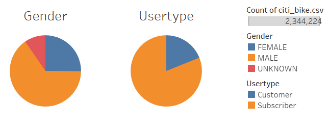
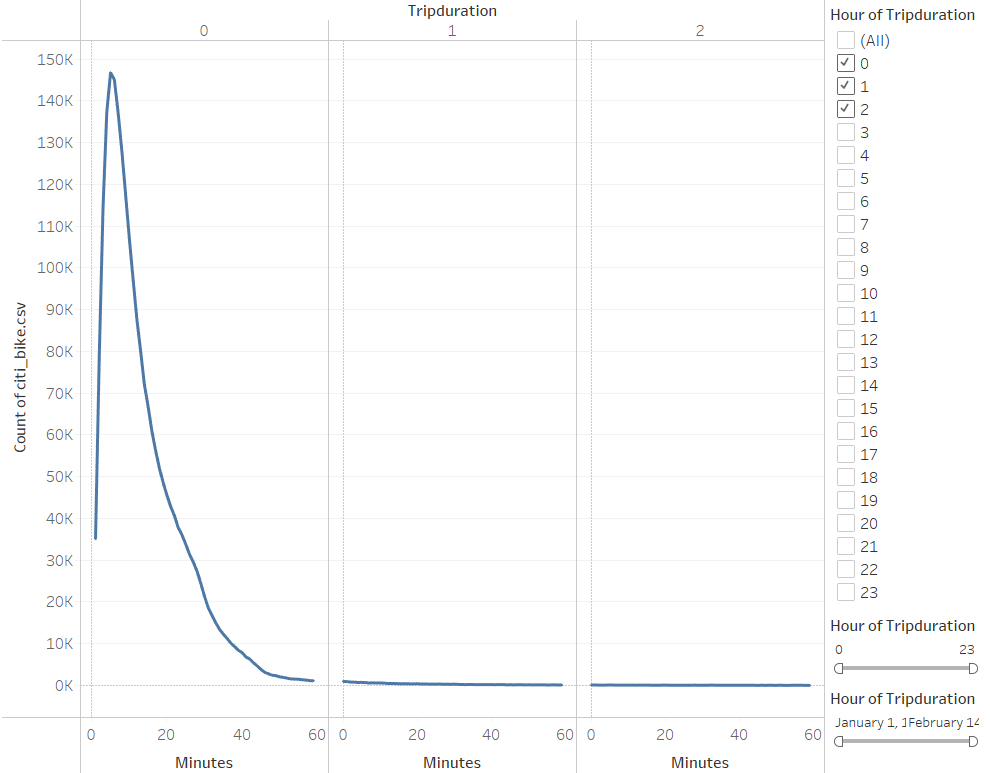
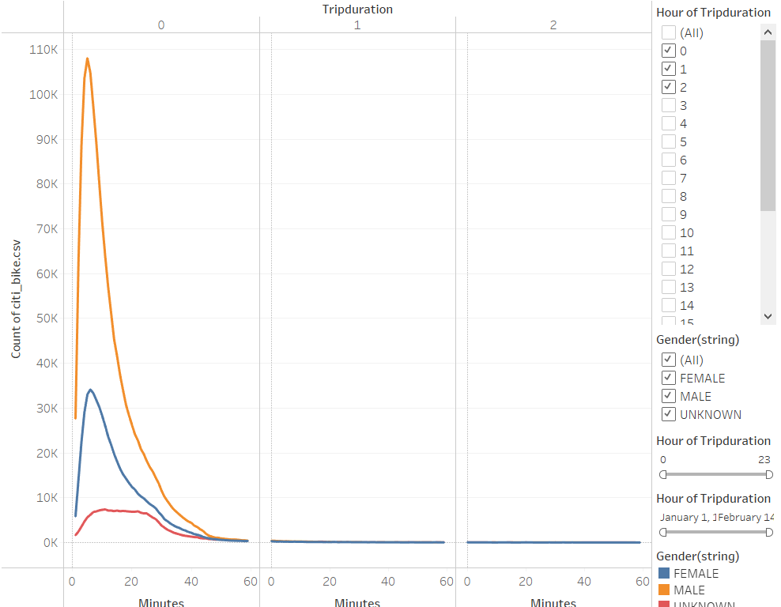
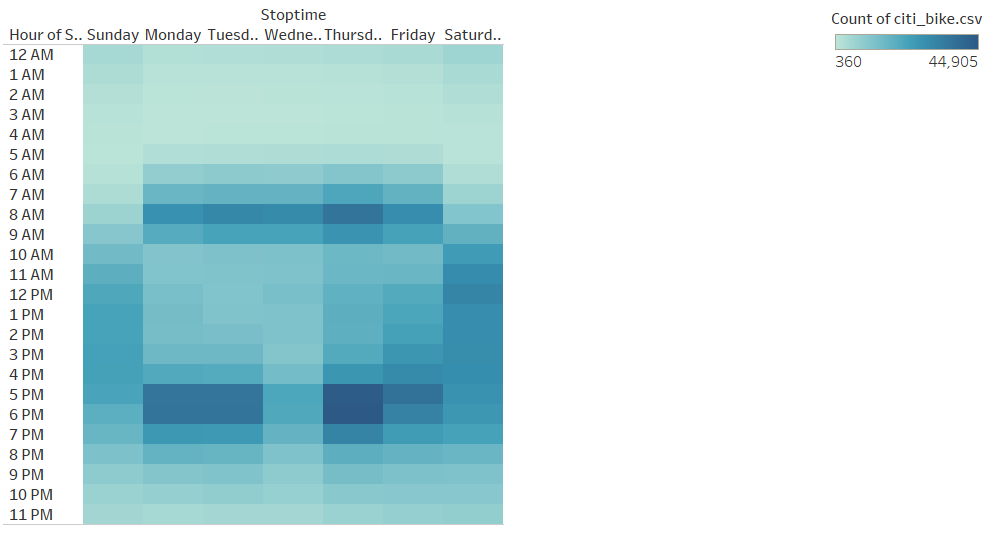
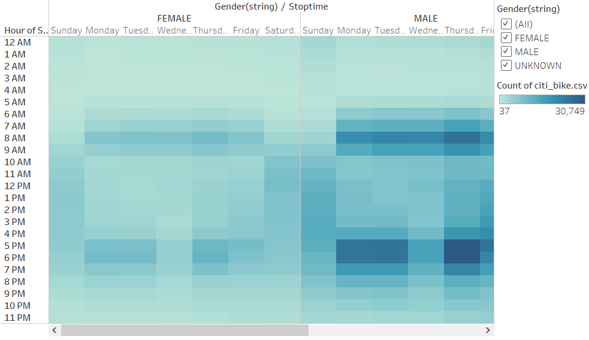
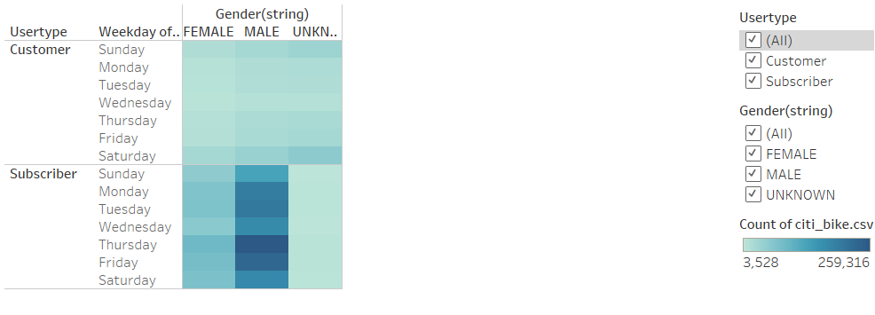
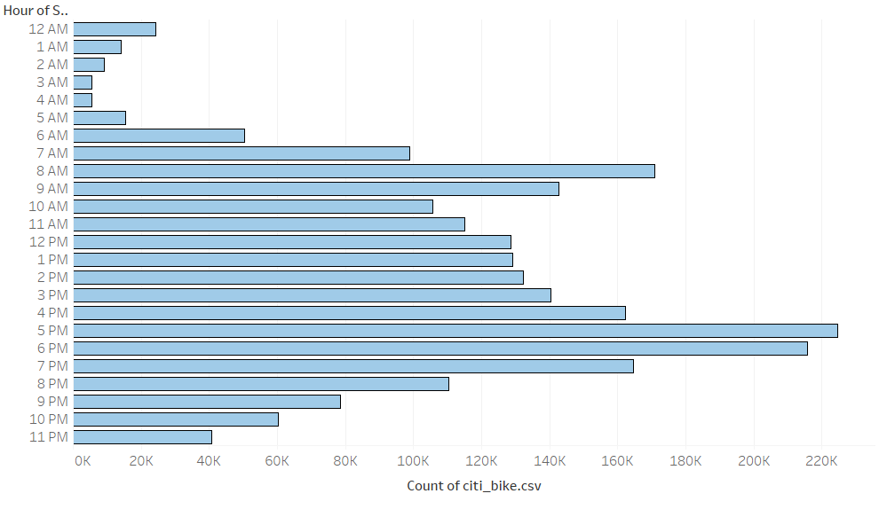

# Citi Bike Report
## Report Overview
- This analysis project provides a visualizatoin of the bikesharing progam, Citi Bike for the month of August 2018 and aid development of future bikesharing programs like Citi Bike. 

-   Focus of the report:
    - Display demographics of its users
    - Show the length of time that bikes are checked out for all riders and genders
    - Show the number of bike trips for all riders and genders for each hour of each day of the week
    - Show the number of bike trips for each type of user and gender for each day of the week
    - Display the peak hours for riding in month of August

- Resources:
    -  Python, Jupyter Notebook, and Tableau were utilzed in this report.
    - Data provided by Citi Bike program in New York City for the month of August 2018.

## Results
### Demographics
- Majority of the users are male and subscribe to this service

### Length of time that bikes are checked out for all riders and genders
- Majority of the users, majority male users, will checkout a bike for 5 minutes

### Number of bike trips for all riders and genders for each hour of each day of the week
- During the work week (Mondays-Fridays) around the 8am and 6pm are the higher frequency of users.

### The number of bike trips for each type of user and gender for each day of the week
- The users (mostly male subscribers) utilize the service the most on Thursdays and Fridays

### The peak hours for riding in month of August
- Peak riding hours occur evenings 4-7pm, and mornings 7-9am
- Higher riding count occurs in the evenings

## Summary/Recommendations
- Looking at the results, majority of the users of this bikesharing service are male and are subscribers. Services are utilized the most during work week and commuting to and from work. The bikes are checked out they riden for about 5 minutes by the user. 

- Having information and data visualization on the age of the user as well as the ethnicity of the user would provide more incite on type of user.

#### *See this report on Tableau Public Website*, [here](https://public.tableau.com/views/Citi_Bike_Report/CitBike?:language=en-US&publish=yes&:display_count=n&:origin=viz_share_link)
